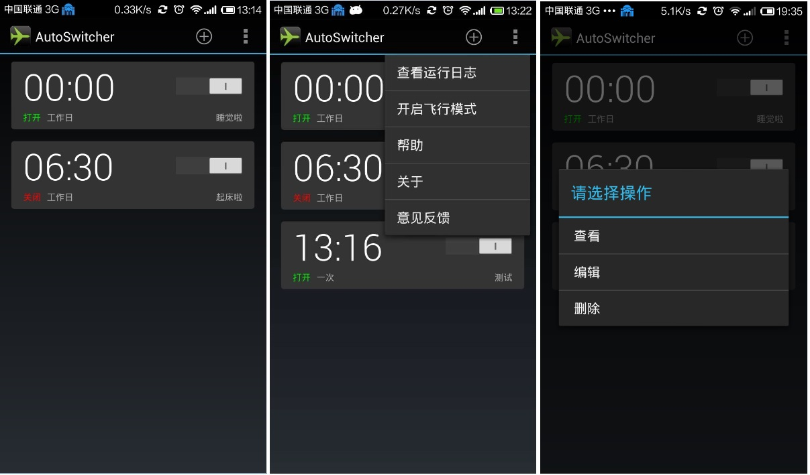
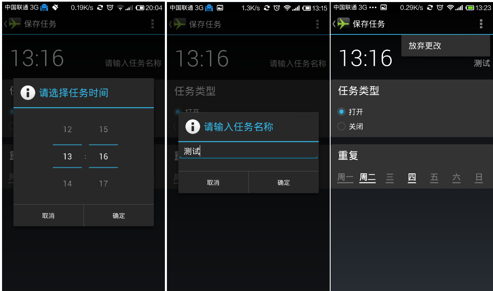
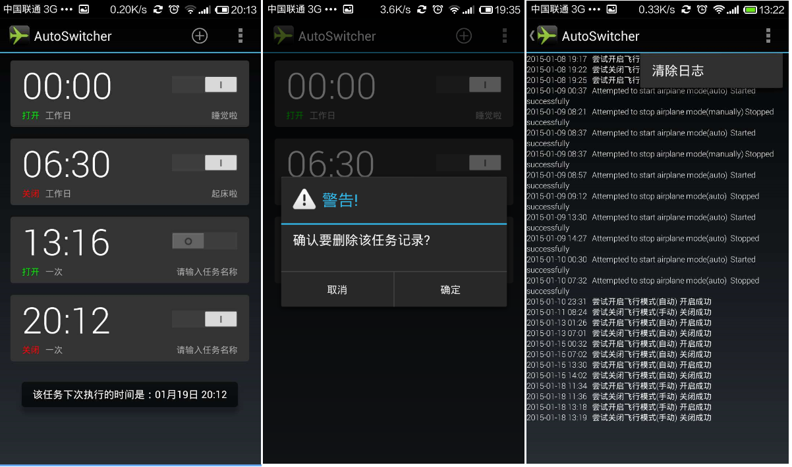
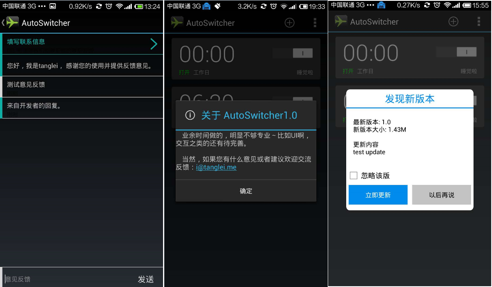
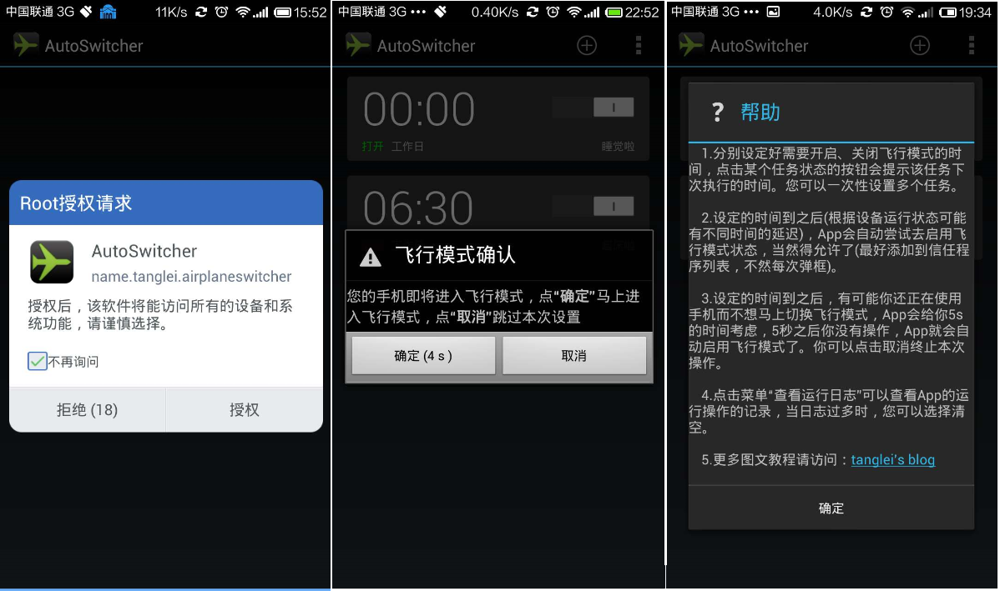

AirPlaneModeSwitcher
===================

- The main project: myAirPlaneMode
- ~~The switch compatLib reference: [SwitchCompatLibrary](https://github.com/ankri/SwitchCompatLibrary) used in [v0.2](https://github.com/tl3shi/AirPlaneModeSwitcher/tree/v0.2)~~
- ~~The actionbar compatLib reference: [actionbarsherlock](https://github.com/JakeWharton/ActionBarSherlock) used in [v0.2](https://github.com/tl3shi/AirPlaneModeSwitcher/tree/v0.2)~~

More details(The history):

- [Android手机定时切换飞行模式代码](http://www.tanglei.name/android-switch-airplanemode-1/)
- 2014-01-23 update: [Android 4.2 自动定时切换飞行模式](http://www.tanglei.name/android-airplanemode-auto-switcher/)
- 2015-01-18 update : [AutoSwither 1.0](http://www.tanglei.name/android-airplanemode-auto-switcher-v2/)

Some snapshots of the [newest version](http://www.tanglei.name/android-airplanemode-auto-switcher-v2/):

